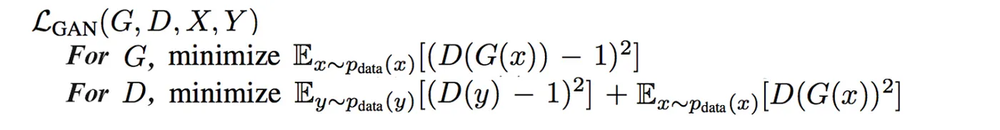
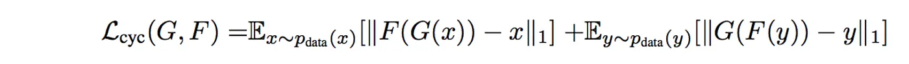
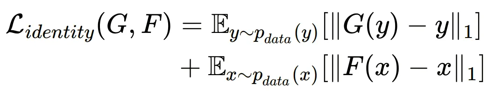
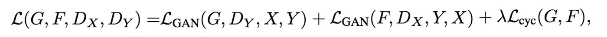
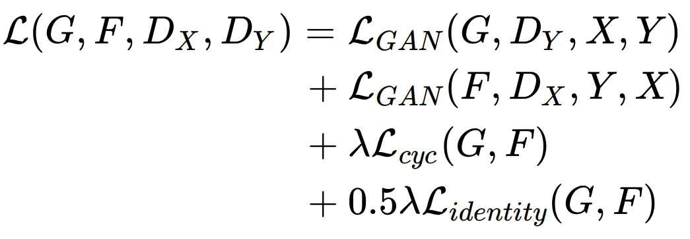
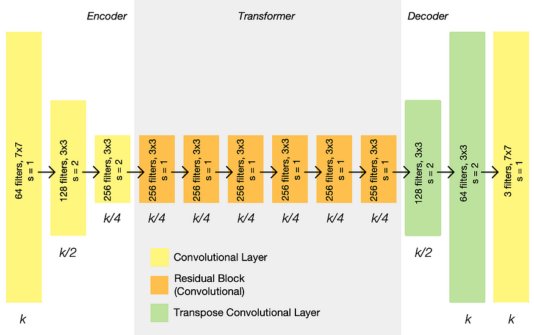
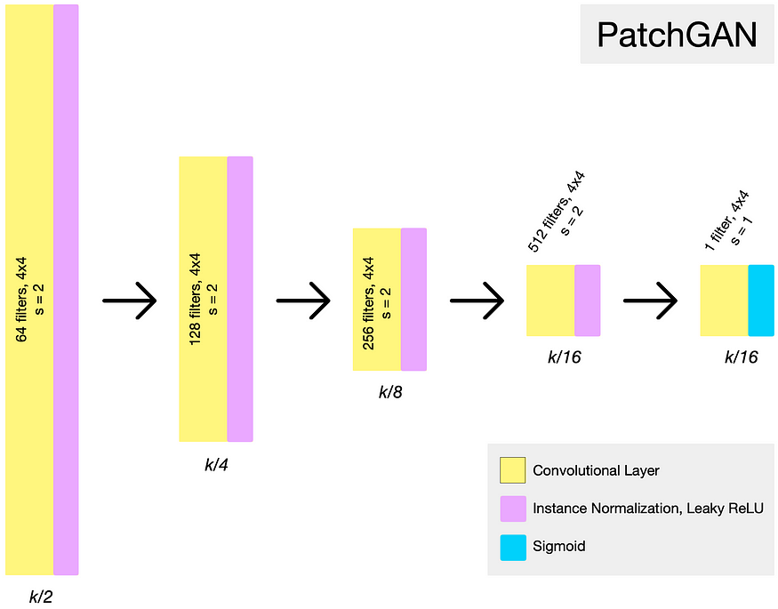
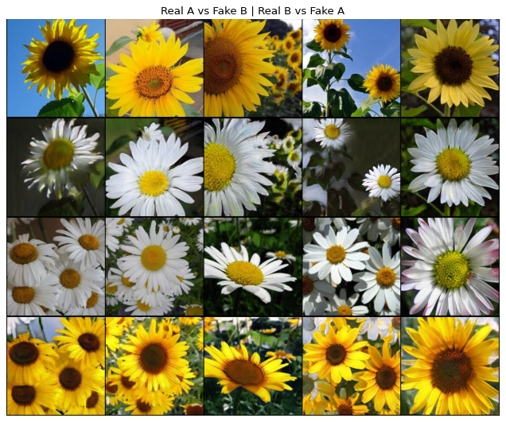
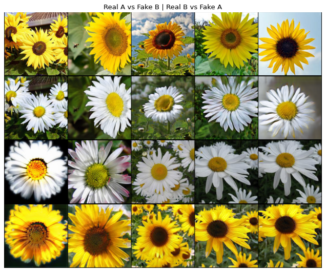
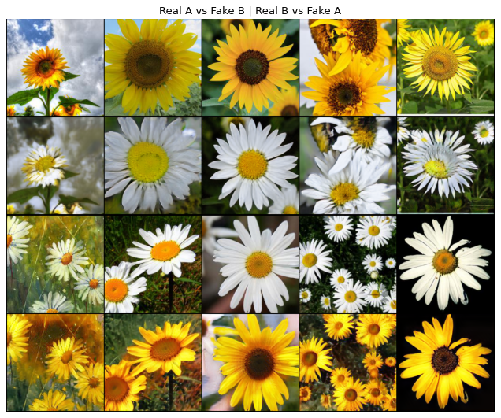

# Cycle GAN: sunflower2daisy

# Overall about Cycle GAN

##  Unpaired Image-to-Image Translation using Cycle-Consistent Adversarial Networks(Cycle GAN)

**Link paper:** [Unpaired Image-to-Image Translation
using Cycle-Consistent Adversarial Networks](https://arxiv.org/abs/1703.10593)


**CycleGAN** is a type of generative adversarial network (GAN) that can be used for image-to-image translation tasks. It was introduced in 2017 by Jun-Yan Zhu, Taesung Park, Phillip Isola, and Alexei A. Efros. The key idea of **CycleGAN** is to use two separate generative networks, one for each direction of image translation (e.g. from horse to zebra), and to train them using a cycle consistency loss that encourages the generated images to be consistent with each other. This allows **CycleGAN** to perform image-to-image translation without the need for paired training data, making it useful for many real-world applications.

## Adversarial Loss



## Cycle Loss

Adversarial training can, in theory, learn mappings G and F that produce outputs identically distributed as target domains Y and X respectively. However, with large enough capacity, a network can map the same set of input images to any random permutation of images in the target domain, where any of the learned mappings can induce an output distribution that matches the target distribution. Thus, an adversarial loss alone cannot guarantee that the learned function can map an individual input x_i to a desired output y_i

Cycle consistency encourages generators to avoid unnecessary changes and thus to generate images that share structural similarity with inputs, it also prevents generators from excessive hallucinations and mode collapse.

This is the Cycle consistency loss which measures the L1-norm reconstruction cost for (x → y → reconstructed x) and (y → x → reconstructed y)



## Identity Loss



## Total Loss (The official loss without the identity term)



## Total Loss (The unofficial loss with the identity term)



## Generator Architecture



## Discriminator Architecture

The discriminators are PatchGANs, fully convolutional neural networks that look at a “patch” of the input image, and output the probability of the patch being “real”. This is both more computationally efficient than trying to look at the entire input image, and is also more effective — it allows the discriminator to focus on more surface-level features, like texture, which is often the sort of thing being changed in an image translation task.



## Applications

1. Image-to-Image Translation: Transform an image from one domain to another such as converting a summer scene to a winter scene.

2. Transferring Styles: Transfer style from one image to another, for example, transferring the style of an artistic painting to a photograph.

3. Video Translation: Translating a video from one domain to another, such as converting a horse riding video to a zebra riding video.

It works well on tasks that involve color or texture changes, like day-to-night photo translations, or photo-to-painting tasks like collection style transfer

## Limitations

1. CycleGAN is not able to disentangle the object from the background

2. CycleGAN is suitable for global image style transfer, but weak at doing object transfiguration

3. Weak at learning the shape of object. It is impossible if we want to use CycleGAN to generating a round object from a quadrate object.

# Results

Some results after 350 epochs (run cycleGAN_sunflower2daisy.ipynb on colab)





**Many of the images created are quite good quality, besides a few images are quite low quality, mainly the background.**

**Weight:**
* [D_A_350](https://drive.google.com/file/d/1-uNjlWaw8Qbpo0spYwnfHKyxFGjL_chw/view?usp=sharing)
* [D_B_350](https://drive.google.com/file/d/1TJyVPZAYGPjwu_Kua-af4zIISeBYnBKu/view?usp=sharing)
* [G_AB_350](https://drive.google.com/file/d/14BZ0EEc0T9Z44QzggKanhPYpM57VorSR/view?usp=sharing)
* [G_BA_350](https://drive.google.com/file/d/1ilTTnwAr0HRAOcub7Z9UNivQw7LBp35v/view?usp=sharing)

# References

https://www.kaggle.com/code/songseungwon/cyclegan-tutorial-from-scratch-monet-to-photo
https://jonathan-hui.medium.com/gan-cyclegan-6a50e7600d7
https://github.com/junyanz/pytorch-CycleGAN-and-pix2pix
https://github.com/luoxier/CycleGAN_Tensorlayer
https://ai.plainenglish.io/what-is-cyclegan-do-you-know-its-use-part-1-for-beginners-629d4d76eb42
https://prinsphield.github.io/posts/2017/07/math_view_cyclegan/##:~:text=Limitations%20of%20CycleGAN&text=CycleGAN%20is%20not%20able%20to,shown%20the%20in%20the%20picture.

```
@inproceedings{CycleGAN2017,
  title={Unpaired Image-to-Image Translation using Cycle-Consistent Adversarial Networks},
  author={Zhu, Jun-Yan and Park, Taesung and Isola, Phillip and Efros, Alexei A},
  booktitle={Computer Vision (ICCV), 2017 IEEE International Conference on},
  year={2017}
}


@inproceedings{isola2017image,
  title={Image-to-Image Translation with Conditional Adversarial Networks},
  author={Isola, Phillip and Zhu, Jun-Yan and Zhou, Tinghui and Efros, Alexei A},
  booktitle={Computer Vision and Pattern Recognition (CVPR), 2017 IEEE Conference on},
  year={2017}
}
```